# Automated Turntable for Fringe Projection 3D Modeling
---
This open source project combines mechatronics and computer vision to find the depth of objects at every angle. The hardware is accomplished with an Arduino microcontroller powering a sturdy LEGO® turntable, which is controlled by a made-from-scratch python module rotating an object to observe all its geometry.

## Motivation
As a mechatronics enthusiast, computer vision is a necessary skill to hone. When advised to make this project open source, it was logical to build the turntable from cherished LEGO® bricks to make it affordable, too.

## Video Demonstration
[Click Here to Watch](https://youtu.be/pxwZWfczoWY)

[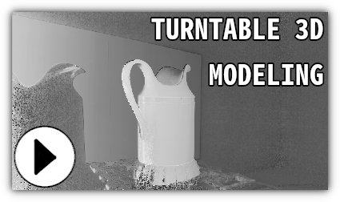](https://youtu.be/pxwZWfczoWY)

---
## Hardware
* [Arduino UNO](https://store.arduino.cc/usa/arduino-uno-rev3)
* [Stepper Motor Driver Module](https://amzn.to/37S7ufj)
* [NEMA17 Stepper Motor](https://amzn.to/2M3aJK2)
* [Breadboard](https://www.amazon.com/DEYUE-breadboard-Set-Prototype-Board/dp/B07LFD4LT6/ref=sr_1_4?dchild=1&keywords=solderless+breadboard&qid=1598765073&sr=8-4)
* [USB Data Sync Cable](https://www.amazon.com/Data-Sync-Cable-Arduino-Microcontroller/dp/B01N9IP8LF/ref=sr_1_1?dchild=1&keywords=arduino+usb+cable&qid=1584604166&sr=8-1)
* 100µF Capacitor
* Jumper Wires
* Webcam or Digital Camera, capable of manual exposure and with female threaded receptacle

The LEGO® brick parts can be acquired by download the [CAD file](turntable_parts.lxf), and following [this tutorial](https://youtu.be/Y3sZaeOtZ2o?t=13) to purchase them. Access building instructions by downloading [LEGO Digital Designer](https://www.lego.com/en-us/ldd), opening the software and then clicking "Building Guide Mode" in the upper right corner. The bearings, which are white 1 x 1 round tiles in the file but transparent yellow in the below image, are to be placed in the slot of the large circle gear rack. The 4 decoupled L-beams are to be attached to the exposed friction pins exposed on the lower half of the bearing. The shaft coupling attaches to the motor by forcing the tube of the 2 x 2 brick around the motor shaft. The 2 x 3 plates, camera stand and projector stand are to be attached to the long beam coming from the turntable ground as one's triangulation circumstances require.
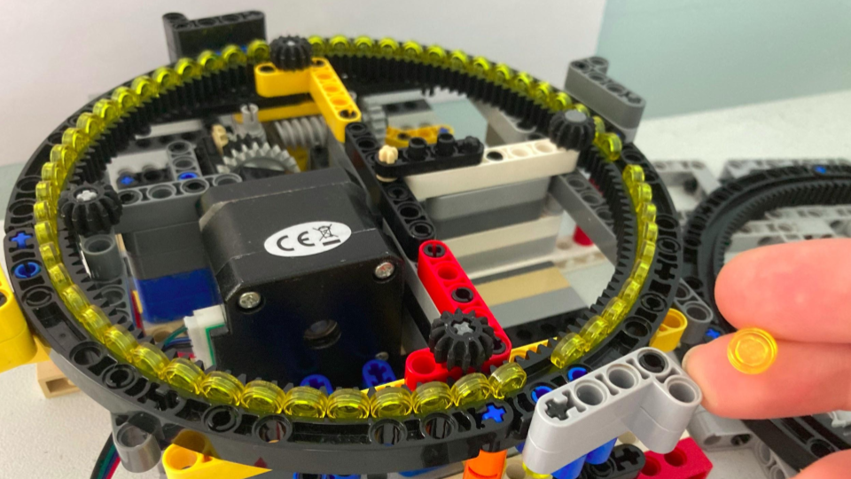 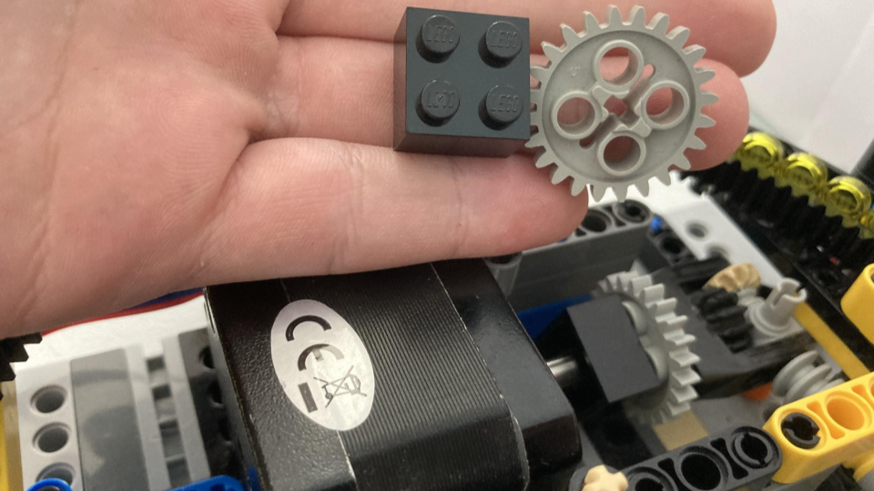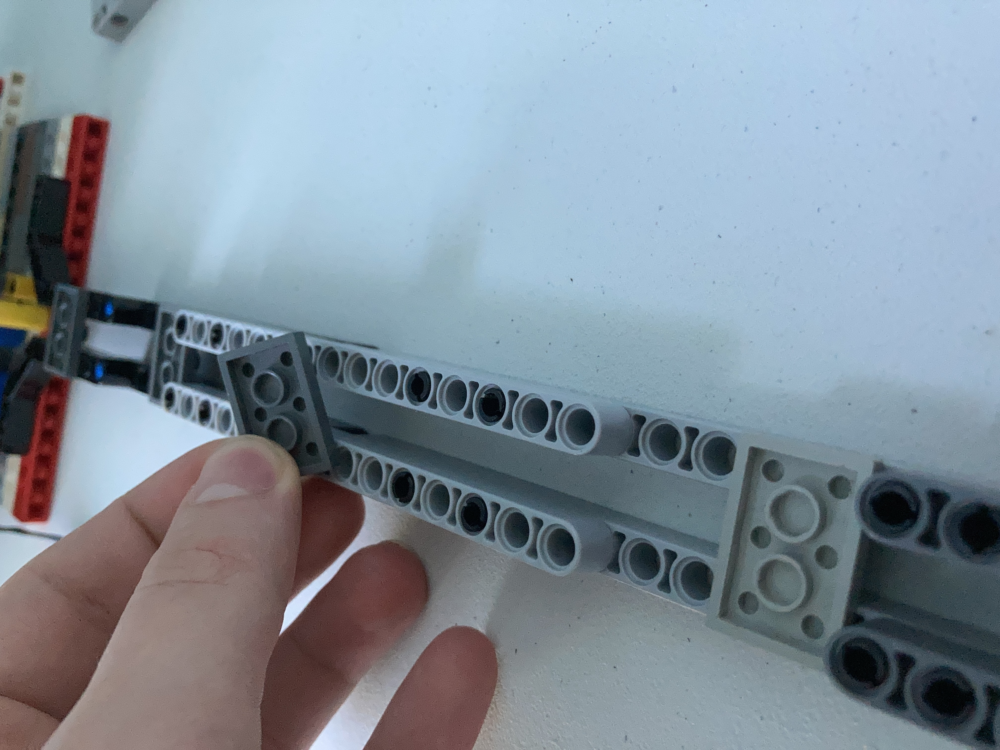 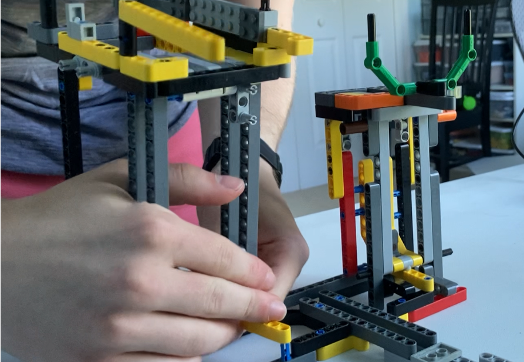

The Arduino electronic schematic can be followed below:

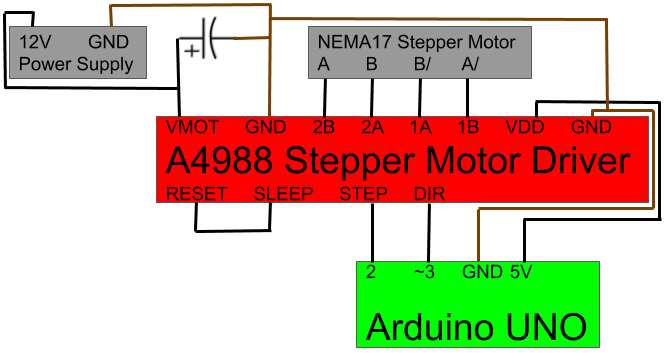

## Getting Started
---
### Requirements
The code files require:
1. [Arduino IDE](https://www.arduino.cc/en/main/software)
2. [Python 3](https://www.python.org/downloads/)
3. [Numpy](https://scipy.org/install.html)
4. [OpenCV](https://opencv.org/releases/)
5. [Serial](https://pypi.python.org/pypi/pyserial)
6. [Matplotlib](https://matplotlib.org/users/installing.html)
7. [The Python Standard Library (for time, subprocess, csv, threading, os, shutil)](https://docs.python.org/3/library/)

Before trying the required software and libraries, run the following from terminal:
`$ sudo apt update`

`$ sudo apt upgrade`
#### 1) Arduino IDE
`$ sudo apt install arduino`
#### 2) Python
`$ sudo apt install python3.6`
#### 3) Numpy
`$ sudo apt install python-numpy`
#### 4) OpenCV
`$ pip install opencv-python`
#### 5) Serial
`$ python -m pip install pyserial`
#### 6) Matplotlib
`$ python -m pip install -U matplotlib`

## How to Run the Code
---
### Arduino UNO
Run `$ arduino` from terminal to open the IDE. Next, click `File > Open` and select `turntable.ino`, located in the turntable folder in this repository.

Connect the microcontroller to the computer via the data sync cable. From the upper toolbar, click `Tools > Board > Arduino UNO` followed by `Tools > Serial Port` where the available port can be selected. In cases where more than one port is proposed, consult [this](https://www.mathworks.com/help/supportpkg/arduinoio/ug/find-arduino-port-on-windows-mac-and-linux.html) document from MathWorks.

One uploads their code by clicking the rightwards arrow. Now onto the Python code!
### Python
#### Part 1: Calibration Preparation

File `camera_test.py` helps one configure their camera for optimal data.

Open `camera_test.py` in an IDE compatible with Python. One connects a webcam or dummy webcam to their PC, and connect the mini projector to the PC via HDMI.

In the main section, modify the webcam port number, width, height and exposure values. Running `python3 camera_test.py` reveals a camera feed and projects an image.
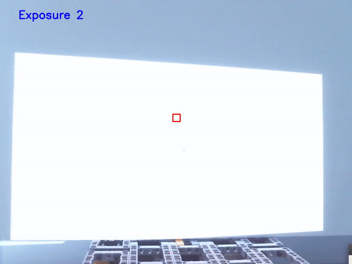

One should see the camera feed toggling between exposures, not just by the "Exposure 1" and "Exposure 2" text on the window, but by the camera feed appearing at different brightness levels. If not, Linux users should use Video4Linux to list available controls

`$ v4l2-ctl -d /dev/video0 --list-ctrls`

Not finding `exposure_auto` among the list means the code cannot set the exposure; one can set many DSLR's/dummy webcam's exposure through that camera's in-built menu or explore other ways to use manual exposure. If one is using an actual webcam, the absense of `exposure_auto` poses a high probability that one's camera cannot do this critical function.

One should position their projector so, when a wall is placed along the axis of the turntable and perpendicular to the beams stemming from the turntable base, the black square on the screen is directly above the rotation axis. One should align their camera so the central, red box encases the small black square from the projector. Offsetting anything before calibration will yield a futile lookup table.
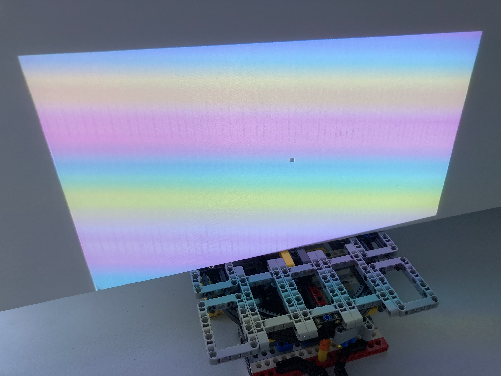

Upon ending the code/while loop, the code with print the average pixel intensity of the cropped area of the camera feed's last frame. Make sure the area is cropped to a region of the projection that is all white pixels; change the exposure values until the average pixel intensity is slightly over 240. The projected fringe patterns span from 50 to 240, hence the average pixel intensity goal.

#### Part 2: Calibration

File `curve_calibration.py` takes hundreds of photos at every non-zero, grayscale, uint8 pixel intensity (1 to 255) to compare how a projected pixel intensity is observed by the camera for a lookup table.

**It is crucial that one follow the instructions in *Part 1: Calibration Preparation*, and ensure alignment between the camera and projector before proceeding.**

Open `curve_calibration.py` in an IDE compatible with Python. One consults the `__init__` function of the VideoStreamWidget class to change one's webcam port number (src), width, height and exposure, as validated in `camera_test.py`. Then run `$ python3 curve_calibration.py`. The terminal updates users with which pixel intensity it is sampling, and reveals a calibration curve at the end for one's own judgment on whether it looks like a S, similar to the Sennheiser logo. Assuming one's camera's manual exposure is working as desired, and that they aligned the camera and projector, the curve should look reasonable.
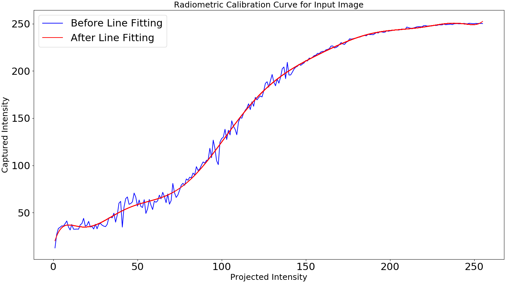 ![Pics used for calibration]

#### Part 3: 3D Modeling

File `turn_fringe.py` takes images of the subject at different angles as multiple fringe patterns are projected on it.

Open `turn_fringe.py` in an IDE compatible with Python. One must connect their Arduino Uno to their computer, the motor's power supply to a wall outlet, a webcam or dummy webcam to their PC, and the mini projector to the PC via HDMI. In the main section, edit the port number, exposure, camera width, camera height, folder, camera_to_projector_distance and to_wall_distance as appropriate. The last three variables deserve elaboration:
* `folder`: Where every image from this experiment will save. This folder will be formed in the script's directory and override a folder with the same name.
* `camera_to_projector_distance`: The Euclidean distance from the lens of the projector to where the camera lens meets the camera body approximates the length. Measuring in LEGO units, where each circle is 8mm wide, helps. Assign the numerical distance to the variable.
* `to_wall_distance`: The Euclidean distance from halfway between the camera-to-projector line to the End of the turntable. Assign the numerical distance to the variable.
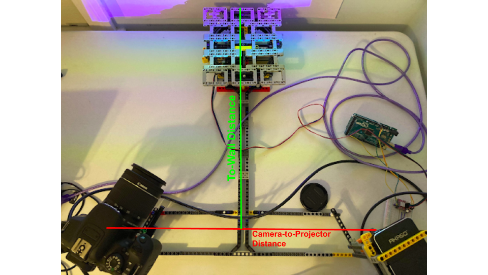

Run `$ python3 turn_fringe.py`. Input fields appear; below is clarification on how one might want to answer each.
* *Number of Steps*: A fringe pattern will be projected at equal offset increments summing from 0 to 2π, with the number of increments determined by one's input. Four steps is often a reasonable choice.
* *Number of Fractions of Rotations*: This input causes the turntable to photograph the object at angle multiples of 360/input. For example, inputting 4 causes the object to be positioned at 90, 180, 270 and 0 degrees.
* *Enter a LOW number of periods along x-axis*: This must be greater than 0 but no greater than 1. If the user puts an invalid answer as the input, the frequency defaults to 0.25.
* *Enter a HIGH number of periods along x-axis*: This must be greater than 1. If the user puts an invalid answer as the input, the frequency defaults to 5.

The procedure will begin by rotating the turntable, then projecting and capturing fringe projections on the subject, and repeat until every pattern at every angle is photographed. The files are then converted into phase maps and disparity maps; the latter are portrayed as point clouds, surface plots, cross-section plots, and plots correlating grayscale color to depth.
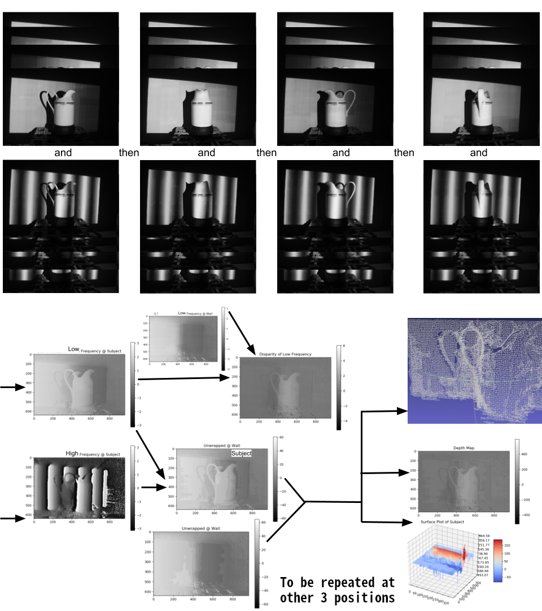

If one desires to modify their plots, or make plots from photos they already have without triggering the turntable, camera or projector, they can use the `data_files` function independently. The captured fringe images' folder is the only link between both parts of the script.

#### Best Results
This creamer was illuminated with a **LOW** frequency of **0.25** and a **HIGH** frequency of **5**
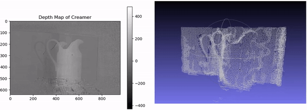
## Future Possibilities
A factor limiting the quality of the point clouds was finding good frequencies for an optimal depth map. A disparity map comparing two parallel walls, separated by 138mm, and projected with the same frequencies yielded nearly perfect flat walls, besides a few sample points only visible by squinting at the below figures.  While this looks promising, a disparity map comparing low and high frequency images gave results leaving something to be desired.

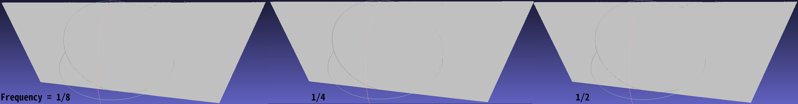

*The next goal would be fusing images from different views.* With emphasis on the camera and projector's center pixels triangulating along the axis of rotation, transforming should be as simple as eliminating wall points for cleanliness, then rotating each point cloud the numbers of rotated degrees times -1 before merging them into one file. This would be under lenient standards of accuracy.

Pixel-by-pixel calibration could also be explored; a function for it is in the fringe projection file but was not executed per suspiciously subpar results.

## References
[1] Zuo, Chao, et al. “Phase Shifting Algorithms for Fringe Projection Profilometry: A Review.” *Optics and Lasers in Engineering*, Elsevier, 15 May 2018, www.osti.gov/biblio/1469785.

[2] Rangarajan, Prasanna, et al. “Pushing the Limits of Digital Imaging Using Structured Illumination.” *2011 International Conference on Computer Vision*, Nov. 2011, doi:10.1109/iccv.2011.6126384.

[3] Geng, Jason. “Structured-Light 3D Surface Imaging: a Tutorial.” *Advances in Optics and Photonics*, vol. 3, no. 2, 2011, p. 128., doi:10.1364/aop.3.000128.
